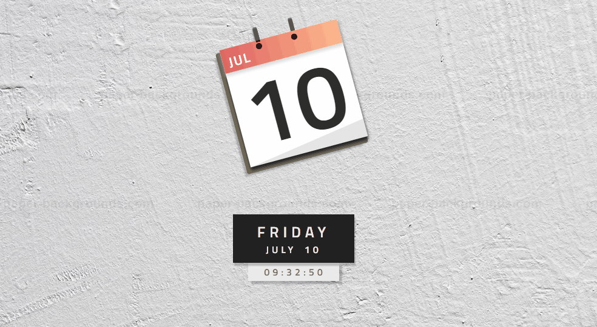

# Calender-and-Clock
Minimal Design Calendar and Clock Effects Using HTML, CSS and JavaScript 

Just download the respository and unzip the file.  

Open index.html file and here you go.  

Enjoy the calendar with working digital clock. 

<h4>Follow me in github for more intresting project</h4>

